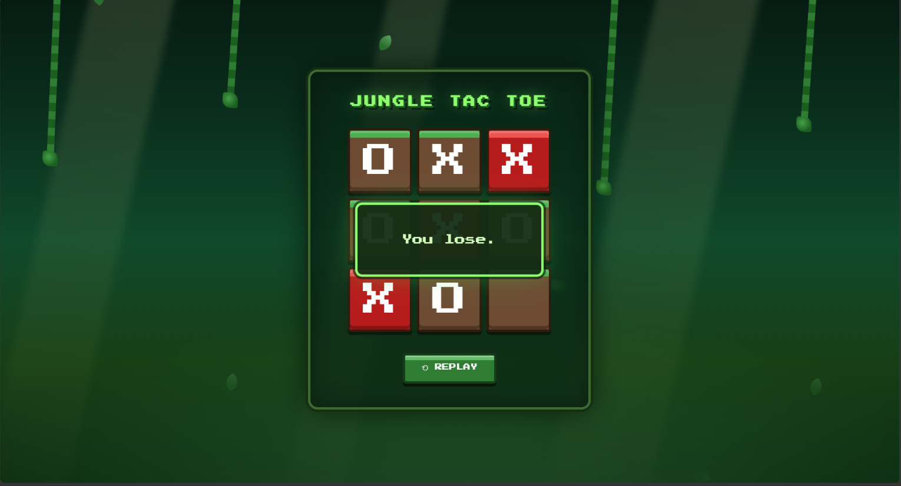

# Jungle Tic Tac Toe

A classic Tic Tac Toe game with a jungle and Minecraft inspired design, built with plain HTML, CSS and JavaScript. No frameworks, no build tools, just open the file and play.

You play as O and the computer plays as X. And here is the honest truth: you will not beat it.

## Why you cannot win

The computer is powered by the minimax algorithm. On every single move, it looks ahead through every possible way the game could play out, all the way to the end. It assumes you will play perfectly, and then it picks the move that gives you the worst possible outcome.

- If a winning move exists for the computer, it takes it
- If you have a winning move next turn, it blocks it
- If neither is available, it moves you toward a position where your best case is a draw

Because of this, the absolute best result a human can get against this game is a tie. Winning is mathematically impossible. Do not feel bad about it, that is just what minimax does. Try it as many times as you want, it will not slip up.

Anyone can Try to Beat it here:

https://davidx-004.github.io/Unbeatable-TIK-TAK-TOE/
